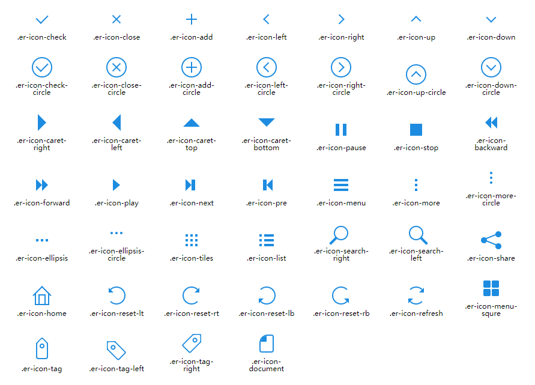

### 纯css实现的简易icon图标库

  本图标库为业余时间写成，里面用到了css3的属性，现代浏览器支持没有问题，不支持IE9以下的浏览器，谷歌浏览器没有问题，在部分浏览器下样式会出现细微偏差，并未做处理，个人项目请随便使用，正式项目中请谨慎使用

#### 效果图

#### 使用办法

  将本项目下载下来之后，直接添加图标对应的样式class名即可，图标大小可通过设置font-size来调整，基准值为20px，颜色可通过设置color来设置